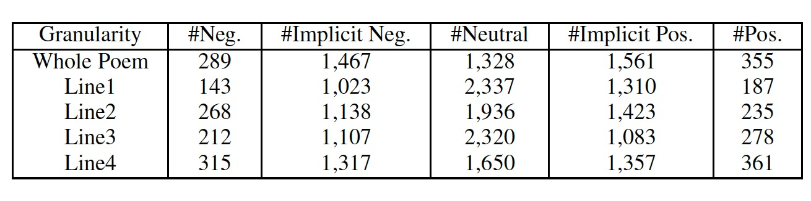

Fine-grained Sentimental Poetry Corpus (FSPC)
==========
FSPC is a manually-labelled Fine-grained Sentiment Poetry Corpus. Each poem and each line is annotated into 5 classes, namely negative, implicit negative, neutral, implicit positive and positive.

Details of the corpus please look into our paper.

## 1. Statistics and Version
### V1.0
* Number of poems: 5,000
* Sentiment Classes: negative, implicit negative, neutral, implicit positive and positive
* The Genre of poetry: Chinese quatrain (*Jueju*, 绝句)

Detailed Statistics:

Neg. is the abbreviation of negative and Pos. is the abbreviation of positive.

## 2. Format
FSPC is saved in JSON format. Each line is a poem. An example is as follows:

```
{
    "poet":"陆游",
    "poem":"东 风 吹 雨 送 残 春|冉 冉 年 光 次 第 新|君 看 枝 头 如 许 绿|争 教 桃 李 不 成 尘",
    "dynasty":"宋",
    "setiments":"5|4|4|5|5",
    "title":"晓雨二首"
}
```
Lines and sentiments in a poem are split by "|". Sentiments for each poem are listed in order: the holistic sentiment of whole poem | sentiment of the first line | sentiment of the second line | ... | sentiment of last line.

## 3. Cite
If you use this corpus, please cite the following paper:

Huimin Chen, Xiaoyuan Yi, Maosong Sun, Cheng Yang, Wenhao Li and Zhipeng Guo. 2019. Sentiment-Controllable Chinese Poetry Generation. In *Proceedings of the Twenty-Eighth International Joint Conference on Artificial Intelligence*, Macao, China. \[[pdf](http://114.215.64.60/~chm/publications/ijcai2019_SCPG.pdf)\]

bib format:
```
@inproceedings{chensentiment:19,
    author  = {Huimin Chen and Xiaoyuan Yi and Maosong Sun and Cheng Yang and Wenhao Li and Zhipeng Guo},
    title   = {Sentiment-Controllable Chinese Poetry Generation},
    year    = "2019",
    booktitle = {Proceedings of the Twenty-Eighth International Joint Conference on Artificial Intelligence},
    address = {Macao, China}  
}
```
